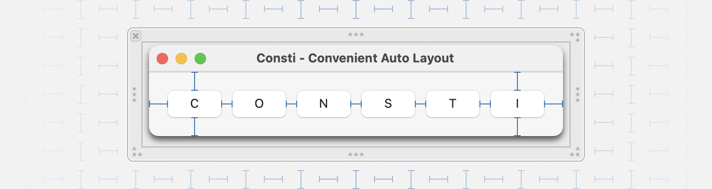

# Consti
Consti is a tiny library to make working with Auto Layout more convenient.

# Supported Platforms
Consti supports iOS, macOS, macCatalyst, tvOS and visionOS.

# Installation
Add this to your `Package.swift` file.

```swift
// Add this to the dependencies of your package.
.package(url: "https://github.com/kaiengelhardt/consti", from: "1.0.0"),

// Then add this to the dependencies of the targets you want to use Consti in.
.product(name: "Consti", package: "Consti"),
```
# Usage

## Constraint Creation APIs
Consti provides you convenience APIs for the most common cases of creating Auto Layout constraints.

### 1. Pin to Edges
```swift
view.addSubview(contentView)
contentView.translatesAutoresizingMaskIntoConstraints = false

// Instead of this:
NSLayoutConstraint.activate([
	contentView.leadingAnchor.constraint(equalTo: view.leadingAnchor),
	contentView.topAnchor.constraint(equalTo: view.topAnchor),
	contentView.trailingAnchor.constraint(equalTo: view.trailingAnchor),
	contentView.bottomAnchor.constraint(equalTo: view.bottomAnchor),
])

// You can now write this:
NSLayoutConstraint.activate(contentView.constraintsMatchingEdgesOfSuperview())
```

### 2. Pin to Safe Area and Any Other Layout Guide
```swift
view.addSubview(contentView)
contentView.translatesAutoresizingMaskIntoConstraints = false

// Instead of this:
NSLayoutConstraint.activate([
	contentView.leadingAnchor.constraint(equalTo: view.safeAreaLayoutGuide.leadingAnchor),
	contentView.topAnchor.constraint(equalTo: view.safeAreaLayoutGuide.topAnchor),
	contentView.trailingAnchor.constraint(equalTo: view.safeAreaLayoutGuide.trailingAnchor),
	contentView.bottomAnchor.constraint(equalTo: view.safeAreaLayoutGuide.bottomAnchor),
])

// You can now write this:
NSLayoutConstraint.activate(contentView.constraintsMatchingEdges(of: view.safeAreaLayoutGuide))
```

### 3. Provide Insets, Use Relations and More
```swift
view.addSubview(contentView)
contentView.translatesAutoresizingMaskIntoConstraints = false

// Constrain contentView the have at most the area of the view, minus 40 points on each side.
NSLayoutConstraint.activate(
	contentView.constraintsMatchingEdges(
		of: view,
		insetBy: NSDirectionalEdgeInsets(top: 40, leading: 40, bottom: 40, trailing: 40),
		relation: .lessThanOrEqual
	)
)

// Constrain contentView to have the double the width and 32 points more in height than someOtherView.
NSLayoutConstraint.activate(
	contentView.constraintsMatchingSize(
		of: someOtherView,
		resizedBy: CGSize(width: 0, height: 32),
		multipliedBy: CGSize(width: 2, height: 1)
	)
)
```

### 4. Set Priorities
```swift
NSLayoutConstraint.activate([
	contentView.leadingAnchor.constraint(equalTo: view.safeAreaLayoutGuide.leadingAnchor),
	// Set priority without needing to assign to a local variable.
	contentView.topAnchor.constraint(equalTo: view.safeAreaLayoutGuide.topAnchor)
		.with(priority: .defaultLow),
	contentView.trailingAnchor.constraint(equalTo: view.safeAreaLayoutGuide.trailingAnchor),
	contentView.bottomAnchor.constraint(equalTo: view.safeAreaLayoutGuide.bottomAnchor),
])

// Set priority on an entire array of constraints.
NSLayoutConstraint.activate(contentView.constraintsMatchingEdges(of: view.safeAreaLayoutGuide)
	.with(priority: .defaultHigh))
```

### 5. Other
```swift
// Set up aspect ratio.
imageView.aspectRatioConstraint().isActive = true // 1:1 aspect ratio
imageView.aspectRatioConstraint(ratio: 16 / 9).isActive = true // 16:9 aspect ratio

// Center a view.
NSLayoutConstraint.activate(imageView.constraintsMatchingCenterOfSuperview())

// Match the size of one view to another.
NSLayoutConstraint.activate(imageView.constraintsMatchingSize(of: someOtherView))

// Match the size of an array of views.
let buttons = [/* ... */]
NSLayoutConstraint.activate(buttons.constraintsMatchingSize())
```


## The `@ActiveConstraint` Property Wrapper
`@ActiveConstraint` is a property wrapper, which helps you correctly activate and deactivate mutually exclusive layout constraints. Just mark a property of type `NSLayoutConstraint`, `[NSLayoutConstraint]` or `NSLayoutConstraint?` with `@ActiveConstraint` and assign properties you want to be active to the property. If you subsequently assign properties again, the previously assigned constraints will be deactivated, thus preventing the common "Unable to simultaneously satisfy constraints" error.

### Example
Here's an example showing how you might change the constraints for a button that should have a completely different layout in portrait vs landscape on iPhone.

```swift
@ActiveConstraint() private var buttonConstraints: [NSLayoutConstraint]

override func traitCollectionDidChange(_ previousTraitCollection: UITraitCollection?) {
	super.traitCollectionDidChange(previousTraitCollection)
	let isiPhonePortrait = traitCollection.verticalSizeClass == .regular
		&& traitCollection.horizontalSizeClass == .compact
	if isiPhonePortrait {
		buttonConstraints = ... // Constraints for portrait layout.
	} else {
		buttonConstraints = ... // Constraints for landscape layout.
	}
}

```

# Contributions
Contributions in general are welcome, however there is a few guidelines to follow:

1. This package is not intended to be a replacement for the Auto Layout API. The philosophy is "Fill the gaps and add a few helpers".
2. New APIs should read and feel like they belong in UIKit directly, e.g. follow the same naming conventions and style.

# License
Consti is available under the MIT license. See the LICENSE file for more info.

# Author
Consti is developed by Kai Engelhardt. Get in touch!

[Mastodon](https://mastodon.social/@kaiengelhardt)

[LinkedIn](https://www.linkedin.com/in/kaiengelhardt/)

# Name
The name of the library is a combination of the word constraint, which this library is all about, and my very good friend and colleague Konsti.
